# Déploiement, Analyse de Télémétrie et Reverse Engineering — Honeypot T-Pot 24.04

> Projet personnel de cybersécurité défensive (Blue Team / Threat Intelligence) — L2

Ce projet documente le déploiement en conditions réelles d'un **honeypot** multi-services (**T-Pot 24.04**) sur un serveur exposé directement sur Internet, la sécurisation de son administration via pare-feu (`ufw`) et VPN maillé (**Tailscale**), la collecte et l'analyse de plus de **160 000 cyberattaques** en 70 heures, ainsi que la **rétro-ingénierie sous Ghidra** d'un binaire malveillant intercepté — un composant du ver **WannaCry**, propagé via la porte dérobée **DoublePulsar**.

---

## Sommaire

1. [Qu'est-ce qu'un honeypot, et pourquoi ce projet ?](#1--quest-ce-quun-honeypot-et-pourquoi-ce-projet-)
2. [Architecture du laboratoire](#2--architecture-du-laboratoire)
3. [Procédure d'installation](#3--procédure-dinstallation)
4. [Sécurisation réseau : pare-feu UFW et VPN Tailscale](#4--sécurisation-réseau--pare-feu-ufw-et-vpn-tailscale)
5. [Vérification et supervision des conteneurs](#5--vérification-et-supervision-des-conteneurs)
6. [Analyse de la télémétrie des cyberattaques](#6--analyse-de-la-télémétrie-des-cyberattaques)
7. [Reverse engineering d'un malware capturé (Dionaea + Ghidra)](#7--reverse-engineering-dun-malware-capturé-dionaea--ghidra)
8. [Bilan et enseignements](#8--bilan-et-enseignements)
9. [Limites et pistes d'amélioration](#9--limites-et-pistes-damélioration)
10. [Glossaire](#10--glossaire)

---

## 1. Qu'est-ce qu'un honeypot, et pourquoi ce projet ?

### 1.1 Le concept, en une phrase

Un **honeypot** ("pot de miel") est un système **volontairement vulnérable** que l'on place sur Internet, non pas pour rendre un vrai service, mais pour **attirer les attaquants** et **observer ce qu'ils font**. Contrairement à un serveur de production, personne n'a de raison légitime de s'y connecter : donc **toute connexion reçue est, par définition, suspecte**. Cela simplifie énormément l'analyse : pas besoin de trier du "bruit normal", tout ce qui arrive est potentiellement une attaque.

C'est l'équivalent numérique d'un piège à souris appâté : on ne cherche pas à empêcher la souris de venir, on veut savoir *combien* de souris passent, *comment* elles entrent, et *ce qu'elles emportent*.

### 1.2 Pourquoi c'est utile

* **Threat Intelligence** : identifier les IP, techniques et outils réellement utilisés par les attaquants automatisés (bots, vers, scanners), pas en théorie mais en observant du trafic réel.
* **Détourner l'attention** : dans un vrai système d'information, un honeypot peut faire perdre du temps à un attaquant et déclencher une alerte avant qu'il n'atteigne une cible réelle.
* **Pédagogie** : c'est un des meilleurs moyens d'observer, en toute légalité et sans risque pour un système de production, à quoi ressemble une attaque "dans la vraie vie" — bien plus riche que des cas d'école.

### 1.3 Pourquoi T-Pot spécifiquement

**T-Pot** (développé par Deutsche Telekom Security) n'est pas *un* honeypot mais une **plateforme qui en orchestre plusieurs en parallèle**, chacun imitant un service différent (SSH, SMB, VoIP, systèmes industriels...), le tout avec une supervision centralisée (tableaux de bord Kibana). L'intérêt : au lieu de devoir déployer et maintenir dix honeypots séparés, on obtient en une seule installation une vision large des types d'attaques qui circulent sur Internet.

### 1.4 Objectifs pédagogiques du projet

- Déployer et **cloisonner correctement** un système volontairement exposé (le honeypot ne doit jamais devenir une porte d'entrée vers le reste de l'infrastructure).
- Mettre en place une **administration distante sécurisée** qui ne soit pas elle-même une surface d'attaque.
- **Collecter et interpréter** des données réelles de télémétrie réseau (volumétrie, origine géographique, protocoles ciblés).
- Pratiquer la **rétro-ingénierie statique** d'un binaire malveillant réel intercepté sur le honeypot.

---

## 2. Architecture du laboratoire

| Élément | Spécification | Rôle / Description |
| :--- | :--- | :--- |
| **Hébergeur** | Contabo | VPS Cloud haute disponibilité |
| **Système d'exploitation** | Debian 12 (Bookworm) | Noyau Linux 6.1 x86_64 hôte |
| **Plateforme Honeypot** | T-Pot 24.04 CE | Orchestration de conteneurs de leurre multi-protocoles |
| **Sondes analysées** | Cowrie, Dionaea, Sentrypeer | Capture SSH/Telnet, SMB/MSRPC et SIP/VoIP |
| **NIDS & Moteur Log** | Suricata, Elasticsearch, Kibana | Détection réseau et indexation/visualisation en temps réel |
| **Accès Sécurisé** | Tailscale (WireGuard) | Accès d'administration distant chiffré sans exposition publique |
| **Station d'Analyse** | REMnux / Kali Linux | Environnement sécurisé isolé avec Ghidra |

> **Pour comprendre — pourquoi séparer "hôte" et "conteneurs" ?**
> T-Pot ne tourne pas directement sur le système Debian : chaque honeypot (Cowrie, Dionaea, etc.) est isolé dans son propre **conteneur Docker**. Cela veut dire que si un attaquant parvient à "casser" un des faux services, il se retrouve enfermé dans un environnement cloisonné, séparé du système réel de la machine. C'est une couche de sécurité supplémentaire indispensable puisque ces services sont, par construction, volontairement vulnérables.

### Schéma logique du flux réseau

```
Internet (attaquants)
 │
 ▼
 ┌─────────────────┐ Ports 1-64000 (honeypots)
 │ VPS Debian 12 │ ◄──── exposés publiquement (SSH, SMB, SIP...)
 │ (pare-feu UFW) │
 └─────────────────┘
 │
 │ Ports admin (64294-64297) filtrés par IP + Tailscale uniquement
 ▼
 ┌─────────────────┐
 │ Poste d'analyse │ (connexion VPN chiffrée, jamais exposée publiquement)
 │ via Tailscale │
 └─────────────────┘
```

---

## 3. Procédure d'installation

### Étape 1 — Préparation de l'environnement Debian

Mise à jour du système et installation des paquets prérequis :

```bash
sudo apt update && sudo apt upgrade -y
sudo apt install -y git curl ufw
```

### Étape 2 — Résolution des conflits de ports natifs

Par défaut, certains services système Debian occupent des ports requis par les sondes de T-Pot (ports 25, 53 et 5355). Leur libération est **obligatoire** pour éviter le crash en boucle du conteneur d'initialisation (`tpotinit`) :

```bash
# 1. Arrêt et désactivation du serveur mail local (port 25)
sudo systemctl stop exim4
sudo systemctl disable exim4

# 2. Désactivation du résolveur local systemd-resolved (ports 53 et 5355)
sudo systemctl stop systemd-resolved
sudo systemctl disable systemd-resolved

# 3. Configuration statique des serveurs de noms
sudo rm -f /etc/resolv.conf
echo "nameserver 1.1.1.1" | sudo tee /etc/resolv.conf
```

> **Pour comprendre — pourquoi ce conflit existe**
> Un service comme `exim4` (serveur mail local) ou `systemd-resolved` (résolveur DNS de Debian) tourne déjà en arrière-plan et **réserve** certains ports au démarrage du système. Or, T-Pot a besoin d'utiliser *ces mêmes ports* pour ses propres honeypots (par exemple un faux serveur mail sur le port 25, pour piéger les spammeurs). Deux programmes ne peuvent pas écouter sur le même port en même temps : il faut donc libérer la place avant de lancer T-Pot.

### Étape 3 — Récupération du dépôt T-Pot

Clonage du dépôt officiel puis passage dans le répertoire du projet :

```bash
git clone https://github.com/telekom-security/tpotce
cd tpotce
ls
```

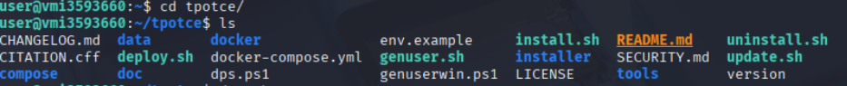
*Figure 1 : Contenu du dépôt officiel T-Pot CE cloné sur la machine hôte.*

### Étape 4 — Lancement de l'installation

Exécution du script d'installation :

```bash
./install.sh
```

Le script demande ensuite de choisir le type d'installation :

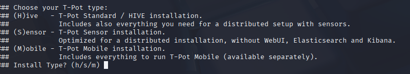
*Figure 2 : Sélection du mode d'installation HIVE/Standard.*

| Mode | Nom complet | Cas d'usage |
| :--- | :--- | :--- |
| **(H)ive** | Installation Standard | Déploiement complet et autonome : WebUI, Elasticsearch, Kibana. **C'est le mode utilisé dans ce projet.** |
| **(S)ensor** | Installation Sensor | Honeypot "sans cerveau" : capture les données mais les envoie vers une instance HIVE distante. Utile pour multiplier les points de collecte. |
| **(M)obile** | Installation Mobile | Version allégée, pensée pour du matériel aux ressources limitées. |

---

## 4. Sécurisation réseau : pare-feu UFW et VPN Tailscale

C'est sans doute la partie la plus critique du projet : **exposer volontairement un serveur vulnérable sur Internet est dangereux si l'administration de ce serveur n'est pas, elle, parfaitement cloisonnée.** L'objectif ici est simple : les honeypots doivent être accessibles à n'importe qui (c'est leur rôle), mais les interfaces d'administration (SSH réel, Kibana) ne doivent être joignables que par moi.

### 4.1 Règles UFW initiales

`ufw` (*Uncomplicated Firewall*) est une surcouche simplifiée d'`iptables`, le pare-feu natif de Linux. Il permet de définir, port par port, qui a le droit de se connecter.

| Port | Usage |
| :--- | :--- |
| `64294/TCP` | Port de secours / Web administration Cockpit |
| `64295/TCP` | SSH d'administration de l'hôte (déplacé par T-Pot) |
| `64297/TCP` | Interface Web de visualisation (Kibana / T-Pot Web) |
| `1:64000` (TCP/UDP) | Ports d'écoute des honeypots ouverts au web |

> **Pour comprendre — pourquoi ces ports "bizarres" (64294-64297) ?**
> T-Pot déplace volontairement ses services d'administration (SSH réel, interface web) vers des ports élevés et non-standards, très différents du port 22 (SSH) ou 443 (HTTPS) habituels. Ce n'est pas de la sécurité en soi (un attaquant déterminé peut scanner tous les ports), mais ça réduit drastiquement le "bruit" des scanners automatiques qui ciblent en priorité les ports connus. Combiné à la restriction par IP ci-dessous, cela reste néanmoins secondaire par rapport à la vraie protection : le filtrage.

```bash
# 1. Politiques par défaut : tout refuser en entrée, tout autoriser en sortie
sudo ufw default deny incoming
sudo ufw default allow outgoing

# 2. Restriction des ports d'administration à l'IP de gestion
export MY_IP="VOTRE_IP_PUBLIQUE"
sudo ufw allow from $MY_IP to any port 64294 proto tcp comment 'T-Pot Management'
sudo ufw allow from $MY_IP to any port 64295 proto tcp comment 'T-Pot SSH'
sudo ufw allow from $MY_IP to any port 64297 proto tcp comment 'T-Pot Web Kibana'

# 3. Exposition des pièges au trafic Internet (c'est voulu !)
sudo ufw allow 1:64000/tcp comment 'Honeypots TCP'
sudo ufw allow 1:64000/udp comment 'Honeypots UDP'

# 4. Activation
sudo ufw enable
```

> **Pour comprendre — la logique "deny by default"**
> La règle `ufw default deny incoming` refuse **tout** trafic entrant par défaut. On ouvre ensuite *explicitement* uniquement ce qui doit l'être. C'est le principe du **moindre privilège** : plutôt que de se demander "que dois-je bloquer ?" (liste potentiellement infinie), on se demande "que dois-je autoriser ?" (liste précise et maîtrisée). C'est l'inverse de la configuration par défaut de beaucoup de routeurs grand public.

Vérification de la configuration active :

```bash
sudo ufw status
```

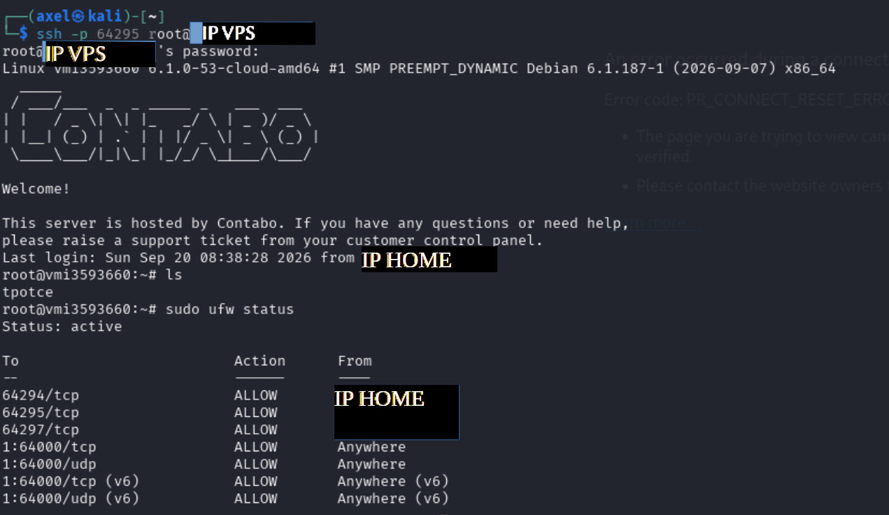
*Figure 3 : Filtrage strict des ports d'administration réservés à l'IP de management.*

### 4.2 Mobilité et accès distant via VPN maillé (Tailscale)

**Problème pratique** : la règle ci-dessus fonctionne tant que je me connecte toujours depuis la même adresse IP. Or en déplacement (réseau 4G, Wi-Fi public, etc.), mon IP publique change en permanence — il faudrait rouvrir manuellement le pare-feu à chaque fois, ce qui est à la fois pénible et risqué (oublier de refermer l'accès).

**Solution : Tailscale**, un VPN maillé basé sur le protocole **WireGuard**. Au lieu de configurer un VPN classique avec un serveur central, Tailscale crée un réseau privé virtuel entre mes appareils : chacun reçoit une IP privée fixe (dans la plage `100.x.x.x`), et le trafic entre eux est chiffré de bout en bout, où que je me trouve physiquement.

1. **Installation sur le VPS Debian :**
 ```bash
 curl -fsSL https://tailscale.com/install.sh | sh
 sudo tailscale up
 ```

2. **Vérification du maillage point à point :**

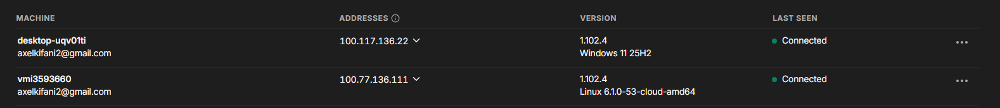
*Figure 4 : Appairage réussi du VPS hôte (`vmi3593660` - 100.77.136.111) et de la station cliente (`desktop-uqv01ti` - 100.117.136.22).*

3. **Cloisonnement sur l'interface virtuelle :**
 Une interface réseau chiffrée dédiée `tailscale0` est instanciée. On peut alors autoriser l'administration uniquement via cette interface, sans dépendre d'une IP publique fixe :
 ```bash
 sudo ufw allow in on tailscale0 to any port 64297 proto tcp comment 'Kibana Tailscale'
 sudo ufw allow in on tailscale0 to any port 64295 proto tcp comment 'SSH Tailscale'
 ```

L'accès s'effectue ensuite de manière sécurisée et chiffrée via : `https://100.77.136.111:64297` — une adresse **injoignable depuis le reste d'Internet**, uniquement accessible aux appareils explicitement rattachés au réseau Tailscale.

> **Pour comprendre — la différence avec un VPN "classique"**
> Un VPN traditionnel (type OpenVPN) fait transiter tout le trafic par un serveur central, qui devient un point de passage obligé (et donc un goulot d'étranglement, voire un point de faiblesse). Un VPN **maillé** comme Tailscale essaie plutôt d'établir des connexions **directes** entre chaque paire d'appareils (comme un réseau pair-à-pair), en ne passant par un serveur relais que si la connexion directe échoue. Résultat : plus rapide, et chaque appareil a un rôle symétrique dans le réseau.

---

## 5. Vérification et supervision des conteneurs

T-Pot repose sur **Docker** : chaque honeypot, chaque brique de log, tourne dans son propre conteneur isolé. Cela permet de vérifier en un coup d'œil que tous les services critiques sont bien démarrés et en bonne santé.

```bash
sudo docker ps
```

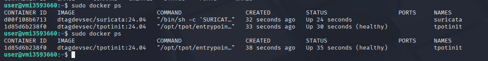
*Figure 5 : Supervision des conteneurs T-Pot en cours d'exécution (statut healthy).*

Accès au portail de visualisation global T-Pot :

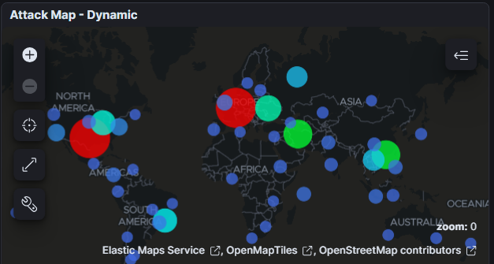
*Figure 6 : Visualisation cartographique globale en temps réel des flux hostiles interceptés.*

---

## 6. Analyse de la télémétrie des cyberattaques

Après plusieurs jours d'exposition directe sur Internet, **sans aucun filtrage en amont**, la volumétrie globale a atteint **162 823 événements enregistrés sur une seule fenêtre de 70 heures** — soit une moyenne de plus de **2 300 tentatives d'intrusion par heure**, sur un serveur qui n'héberge officiellement aucun service réel.

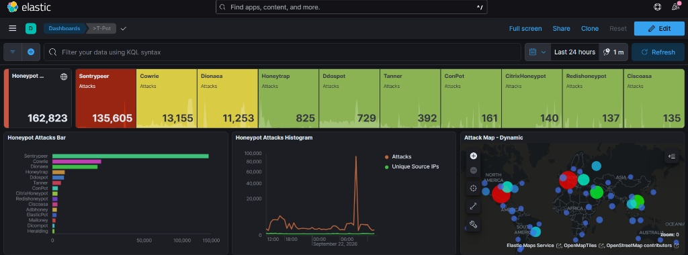
*Figure 7 : Vue générale du tableau de bord Elastic/Kibana affichant les 162 823 événements.*

### 6.1 Volumétrie globale et répartition par honeypot

| Sonde (Honeypot) | Protocole émulé | Événements (70h) | Part de trafic |
| :--- | :--- | :--- | :--- |
| **Sentrypeer** | SIP / VoIP (UDP/TCP 5060) | **135 605** | ~83,3 % |
| **Cowrie** | SSH / Telnet (TCP 22, 23) | **13 155** | ~8,1 % |
| **Dionaea** | SMB / RPC / SQL (445, 135, 3306) | **11 253** | ~6,9 % |
| **Honeytrap** | Connexions réseau génériques | 825 | ~0,5 % |
| **Ddospot** | NTP / SSDP / DDoS amplification | 729 | < 0,5 % |
| **Tanner** | Attaques applicatives Web (SQLi, RCE) | 392 | < 0,3 % |
| **ConPot** | Systèmes industriels (SCADA/ICS) | 161 | < 0,1 % |

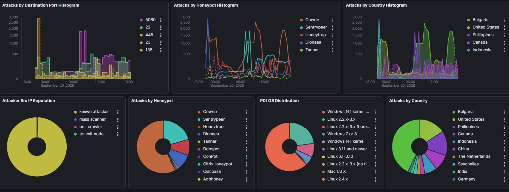
*Figure 8 : Distribution des attaques par ports de destination, sondes et répartition OS p0f.*

#### Observations clés

* **Le pic massif Sentrypeer (VoIP) :** Un assaut coordonné d'environ **92 861 requêtes SIP** a été intercepté à 09h30, provenant d'un groupe restreint de seulement **11 adresses IP sources uniques**.

 > **Pour comprendre — c'est quoi une attaque SIP / toll fraud ?**
 > **SIP** (*Session Initiation Protocol*) est le protocole utilisé pour établir des appels téléphoniques par Internet (VoIP), par exemple sur des standards téléphoniques d'entreprise (PBX). Le **toll fraud** ("fraude à la surtaxe") consiste, pour un attaquant, à prendre le contrôle d'un tel standard téléphonique pour passer massivement des appels vers des numéros surtaxés qu'il contrôle lui-même — facturés à la victime, empochés par l'attaquant. Ce pic représente donc une campagne de **reconnaissance automatisée** : les attaquants scannent Internet à la recherche de standards téléphoniques mal protégés à exploiter ensuite.

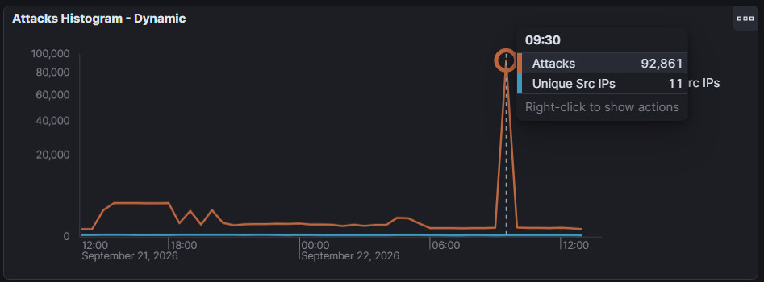
*Figure 9 : Pic de 92 861 requêtes concentré sur 11 adresses IP sources uniques.*

* **Sollicitation soutenue de Dionaea :** 11 253 connexions ciblant en priorité `smbd` (port 445) et `epmapper` (port 135) — les deux services au cœur de la faille **EternalBlue**, exploitée quelques années plus tôt par WannaCry (voir [section 7](#7--reverse-engineering-dun-malware-capturé-dionaea--ghidra)). Ce chiffre montre que, des années après sa divulgation, cette vulnérabilité continue d'être activement recherchée par des scanners automatisés.

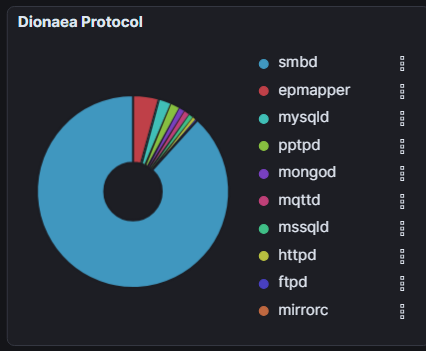
*Figure 10 : Prédominance écrasante du protocole SMB (`smbd`) parmi les cibles de Dionaea.*

### 6.2 Profilage géographique et dynamique spatiale


*Figure 11 : Densité mondiale des vecteurs d'attaque reçus par le honeypot.*

* **Top pays sources :** États-Unis (culminant à 81 % lors de la rafale SIP), Bulgarie, Allemagne, Russie, Viêt Nam et Philippines.

 > **Attention à l'interprétation** — "pays source" signifie ici le pays où se situe l'adresse IP qui a émis l'attaque, pas nécessairement le pays de l'attaquant lui-même. Une grande partie de ce trafic provient très probablement d'appareils compromis (proxys, botnets, serveurs loués anonymement) répartis dans le monde entier, et non d'individus opérant directement depuis ces pays.

<p align="center">
 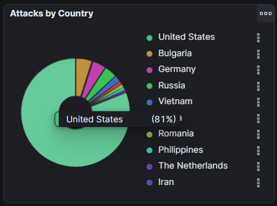
 
</p>
*Figure 12 : Analyse de la répartition par pays d'origine (surconsommation US lors du pic SIP vs répartition européenne diffuse).*

* **Typologie et réputation des sources :** La réputation IP (`Attacker Src IP Reputation`) indique plus de 90 % d'adresses étiquetées comme *mass scanner* ou *known attacker* — c'est-à-dire des adresses déjà répertoriées dans des bases de réputation IP pour un comportement malveillant récurrent, et non de simples utilisateurs isolés.
* **Empreintes TCP/OS (p0f) :** Prédominance de paquets forgés par des systèmes Linux récents/embarqués et des signatures historiques Windows NT — cohérent avec des attaques lancées depuis des serveurs Linux loués en masse (VPS bon marché) et depuis des objets connectés compromis (caméras IP, routeurs...).

### 6.3 Tentatives d'intrusion par force brute (Cowrie)

Sur le honeypot SSH/Telnet **Cowrie**, l'activité oscille continuellement entre les ports 22 et 23 :

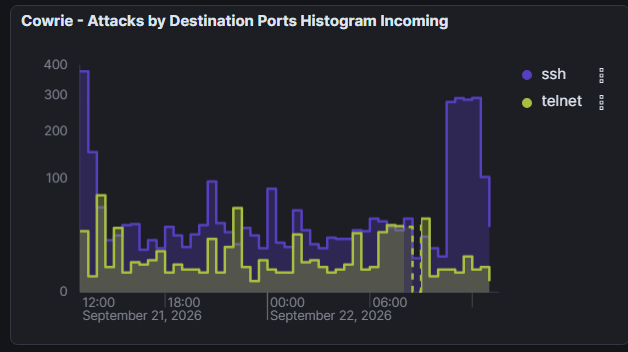
*Figure 13 : Activité comparée des tentatives d'intrusion SSH vs Telnet sur Cowrie.*

#### Commandes post-authentification interceptées

Cowrie n'est pas un simple leurre passif : c'est un honeypot **interactif**. Une fois qu'un script d'attaque "réussit" à s'authentifier (souvent via des identifiants par défaut du type `admin`/`admin`), Cowrie simule un vrai terminal Linux et **enregistre chaque commande tapée** par l'attaquant, sans jamais réellement exécuter quoi que ce soit d'utile sur le système. Dès l'ouverture d'une session, les scripts malveillants déroulent une routine de reconnaissance matérielle :

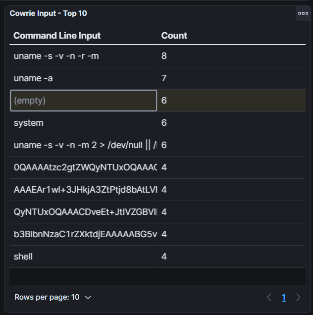
*Figure 14 : Top 10 des commandes de profilage système exécutées sur Cowrie.*

```bash
uname -s -v -n -r -m
uname -a
system
uname -s -v -n -m 2 > /dev/null || ...
```

> **Pour comprendre — pourquoi ces commandes précisément ?**
> La commande `uname` affiche des informations sur le système : type de noyau, architecture du processeur, nom de la machine... Un humain qui pirate un serveur n'a pas besoin de taper ça en premier réflexe. Ces séquences quasi-identiques, répétées par des milliers d'IP différentes, sont la **signature de scripts automatisés** appartenant aux familles de botnets DDoS **Mirai** et **Gafgyt** : avant de télécharger un malware, le script vérifie d'abord l'architecture CPU de la machine infectée (x86_64, ARM, MIPS, SH4...) pour savoir quelle version du binaire ELF (le format d'exécutable Linux) envoyer — un peu comme choisir le bon fichier d'installation selon qu'on est sur Windows ou Mac.

---

## 7. Reverse engineering d'un malware capturé (Dionaea + Ghidra)

Contrairement à Cowrie, qui capture des **scripts shell Linux**, la sonde **Dionaea** émule des services Windows (SMB, RPC...) et a intercepté plusieurs **binaires exécutables Windows** envoyés directement par des attaquants via le port 445.

> **Pour comprendre — c'est quoi le "reverse engineering" ?**
> La rétro-ingénierie (*reverse engineering*) consiste à **analyser un programme sans avoir son code source**, pour comprendre ce qu'il fait réellement. C'est un peu comme essayer de reconstituer la recette d'un plat en le goûtant et en l'analysant chimiquement, sans avoir le livre de cuisine original. Ici, on utilise **Ghidra**, un outil open-source développé par la NSA, qui prend un exécutable compilé et tente de le **décompiler** : reconstruire un code source en langage C lisible à partir du binaire (langage machine).

### 7.1 Extraction et qualification des charges utiles

Localisation sur l'hôte : `/home/user/tpotce/data/dionaea/binaries/`.

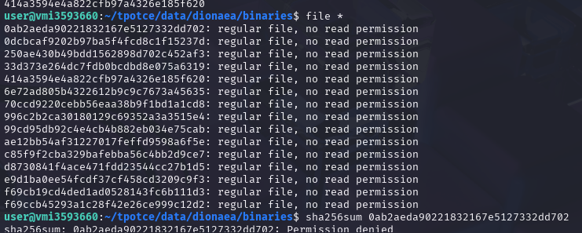
*Figure 15 : Identification des charges utiles interceptées par Dionaea sur le système hôte.*

L'exécution avec privilèges administratifs (`sudo file *`) confirme la présence d'exécutables Windows :
```bash
sudo file *
# Résultat : PE32 executable (DLL) Intel 80386, for MS Windows
```

> **Pour comprendre — c'est quoi un "PE32" ?**
> **PE** (*Portable Executable*) est le format standard des fichiers exécutables sous Windows (`.exe`, `.dll`...), l'équivalent du format ELF sous Linux. "32" indique qu'il s'agit d'un binaire pour architecture 32 bits, "Intel 80386" précise le jeu d'instructions processeur ciblé. C'est cette commande `file` qui permet, en un coup d'œil, d'identifier la nature d'un fichier sans se fier à son extension (qui peut être trompeuse).

Un échantillon nommé d'après son hash MD5 (`0ab2aeda90221832167e5127332dd702`) a été isolé et transféré vers l'environnement d'analyse (REMnux) :

```bash
scp -P 64295 root@100.77.136.111:/home/user/tpotce/data/dionaea/binaries/0ab2aeda90221832167e5127332dd702 ./sample.bin
```

> **Bonne pratique de sécurité** — l'analyse d'un binaire malveillant réel ne doit **jamais** se faire sur la machine principale. Le transfert se fait ici vers **REMnux**, une distribution Linux dédiée à l'analyse de malware, elle-même isolée dans une machine virtuelle sans connexion vers le reste du réseau. Le binaire n'est jamais exécuté : seule une analyse *statique* (lecture du code sans l'exécuter) est réalisée.

### 7.2 Analyse statique et désassemblage sous Ghidra

L'échantillon a été importé dans **Ghidra** au sein d'un projet dédié :

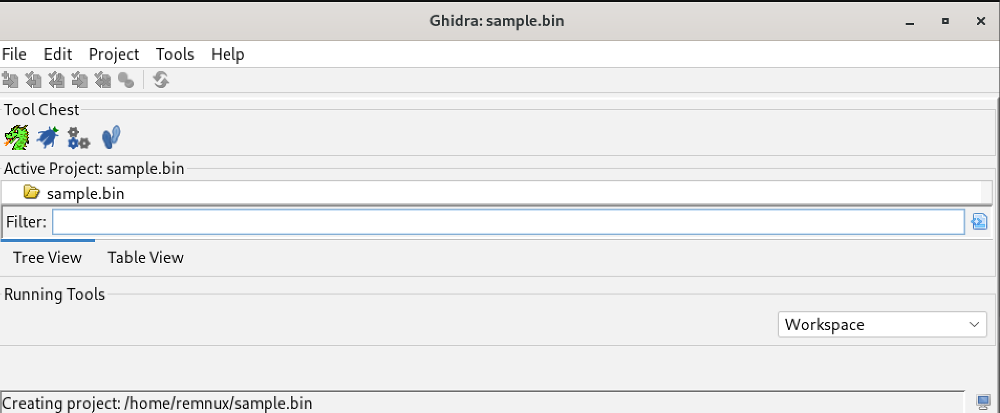
*Figure 16 : Initialisation du projet d'ingénierie inverse dans Ghidra.*

Après lancement de l'analyse automatique, le panneau de décompilation reconstitue le code C de la fonction d'entrée (`entry`) :

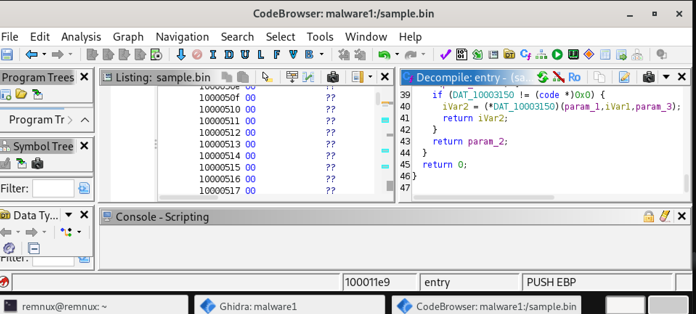
*Figure 17 : Décompilation de la routine d'entrée du binaire.*

#### A. Détection des artefacts textuels (Defined Strings)

Une des premières étapes classiques en analyse de malware consiste à lister toutes les **chaînes de caractères lisibles** contenues dans le binaire (noms de fichiers, messages d'erreur, adresses...) : c'est souvent la source d'information la plus rapide, avant même de lire une seule ligne de code décompilé. L'exploration des chaînes définies révèle ici deux noms explicites :

1. `mssecsvc.exe` : Exécutable ciblé par la routine.
2. `launcher.dll` : Nom interne d'origine de la DLL analysée.

<p align="center">
 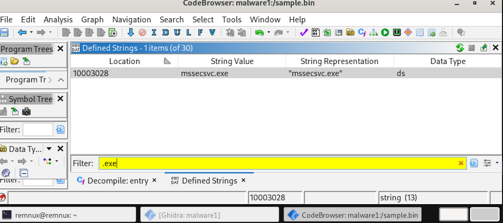
 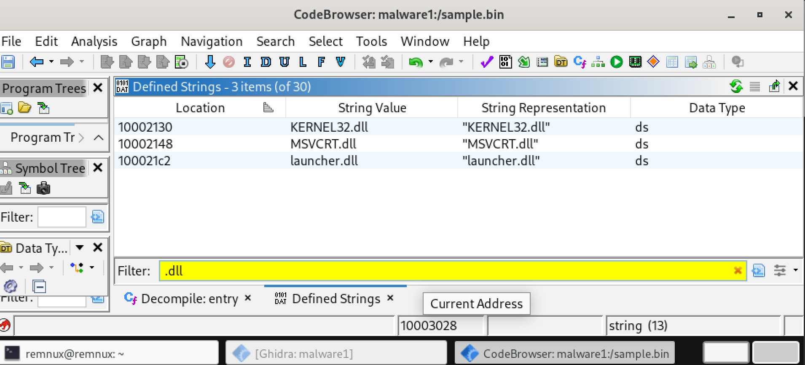
</p>
*Figure 18 : Extraction des artefacts critiques démontrant la présence de la chaîne d'infection WannaCry.*

Ces identifiants sont des **noms de fichiers connus et documentés** associés à un incident majeur de cybersécurité : ils démontrent qu'il s'agit du composant d'injection du ver **WannaCry** (*WanaCrypt0r 2.0*), historiquement propagé via la porte dérobée de niveau noyau **DoublePulsar**, elle-même déployée en exploitant la vulnérabilité SMB **EternalBlue** (référencée **MS17-010**).

> **Pour comprendre — remettre WannaCry en contexte**
> En mai 2017, **WannaCry** a infecté plus de 200 000 ordinateurs dans 150 pays en quelques jours, paralysant notamment des hôpitaux britanniques (NHS). Son mode de propagation était inédit pour un ransomware grand public : il ne nécessitait **aucune action de la victime** (pas de clic sur un lien piégé). Il se propageait tout seul, de machine en machine, en exploitant :
> - **EternalBlue** : une faille critique du protocole SMB (partage de fichiers Windows), initialement découverte et gardée secrète par la NSA, puis divulguée publiquement par le groupe de hackers *The Shadow Brokers*.
> - **DoublePulsar** : une porte dérobée (backdoor), également issue de l'arsenal de la NSA, installée *via* EternalBlue et servant ensuite à injecter n'importe quel code — ici, le composant WannaCry — directement en mémoire, dans le processus système `lsass.exe`.
>
> Le fait de retrouver ce même artefact, encore actif, capturé par un honeypot en 2025-2026, illustre un phénomène bien connu en sécurité : un malware ancien et largement documenté peut continuer à circuler indéfiniment sur Internet via des botnets et des scanners automatisés, bien après que le correctif officiel a été publié (en l'occurrence, dès mars 2017).

#### B. Analyse du point d'entrée et de la table d'exportation

Dans le **Symbol Tree** > **Exports** de Ghidra (la liste des fonctions qu'une DLL rend disponibles pour être appelées depuis l'extérieur), le binaire n'expose qu'**une seule fonction publique** :

* **Nom de l'export :** `PlayGame` — un nom délibérément trompeur et anodin, choisi par les auteurs du malware pour ne pas éveiller les soupçons lors d'une inspection rapide.

Cette fonction est invoquée par l'exploit DoublePulsar une fois la DLL injectée au sein du processus système critique `lsass.exe` (le processus Windows chargé de la gestion des authentifications, un choix qui confère au code injecté des privilèges élevés et une forme de discrétion, puisque `lsass.exe` est un processus systématiquement présent et rarement suspecté).

#### C. Rétro-ingénierie de la fonction d'extraction (`FUN_10001016`)

Ghidra ne connaissant pas le nom d'origine de cette fonction (l'information est perdue à la compilation), il lui attribue un nom générique basé sur son adresse mémoire : `FUN_10001016`. Son étude met en évidence le mécanisme de largage (*dropper*) du malware — la technique qui consiste à extraire un second fichier caché à l'intérieur du premier, puis à l'écrire sur le disque :

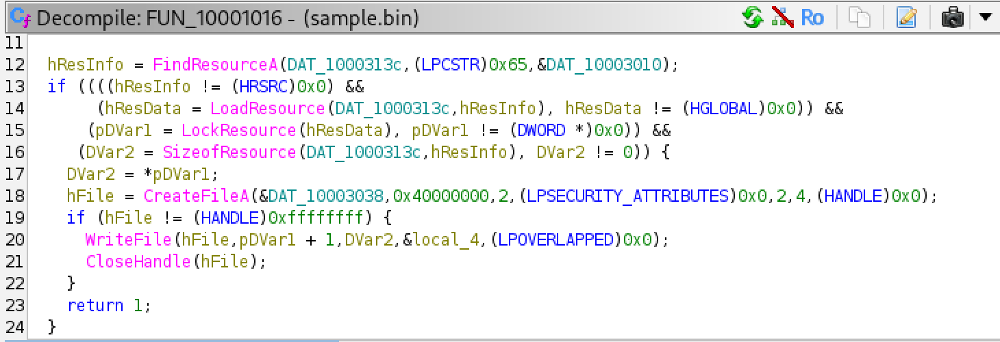
*Figure 19 : Routine d'extraction et d'écriture de la charge utile sur le disque dur.*

```c
// Code décompilé dans Ghidra (FUN_10001016)
hResInfo = FindResourceA(DAT_1000313c, (LPCSTR)0x65, &DAT_10003010);
if ((((hResInfo != (HRSRC)0x0) &&
 (hResData = LoadResource(DAT_1000313c, hResInfo), hResData != (HGLOBAL)0x0)) &&
 (pDVar1 = LockResource(hResData), pDVar1 != (DWORD *)0x0)) &&
 (DVar2 = SizeofResource(DAT_1000313c, hResInfo), DVar2 != 0)) {
 DVar2 = *pDVar1;
 hFile = CreateFileA(&DAT_10003038, 0x40000000, 2, (LPSECURITY_ATTRIBUTES)0x0, 2, 4, (HANDLE)0x0);
 if (hFile != (HANDLE)0xffffffff) {
 WriteFile(hFile, pDVar1 + 1, DVar2, &local_4, (LPOVERLAPPED)0x0);
 CloseHandle(hFile);
 }
 return 1;
}
return 0;
```

#### Décomposition analytique de la routine

> **Pour comprendre — la technique du "dropper" en une image**
> Imaginez une DLL comme une valise. La plupart des logiciels ne transportent que ce dont ils ont besoin pour fonctionner. Un *dropper*, lui, cache un **second exécutable complet** dans un compartiment secret de sa propre valise (ici, la **section "ressources"** du fichier PE, normalement prévue pour stocker des icônes, images ou textes). Une fois lancé, il ouvre ce compartiment, en sort le fichier caché, et l'écrit sur le disque de la victime — un peu comme une poupée russe.

1. **Localisation de la ressource interne (`FindResourceA` & `LoadResource`) :** la DLL recherche, dans sa propre section de ressources, un bloc de données identifié par l'ID `0x65` (101 en décimal), puis le charge en mémoire vive.
2. **Verrouillage du tampon (`LockResource` & `SizeofResource`) :** récupération de l'adresse mémoire exacte du payload caché, et de sa taille en octets — l'équivalent de "où se trouve le fichier caché, et combien pèse-t-il ?".
3. **Création du fichier sur le disque (`CreateFileA`) :** création d'un nouveau fichier vide, dont le nom correspond à la variable `DAT_10003038` — c'est-à-dire, justement, la chaîne **`mssecsvc.exe`** identifiée à l'étape précédente.
4. **Écriture de la charge utile (`WriteFile` & `CloseHandle`) :** les octets du payload caché sont copiés dans ce nouveau fichier, puis le fichier est refermé — l'extraction est terminée.

Cet exécutable déposé (`mssecsvc.exe`) est ensuite démarré en tâche de fond, déguisé en faux service de sécurité Windows, pour **scanner le réseau local et Internet sur le port 445 (SMB)** à la recherche d'autres machines vulnérables à EternalBlue — assurant ainsi la propagation autonome du ver — avant de déclencher, sur la machine infectée, la phase de **chiffrement des fichiers** caractéristique d'un ransomware.

---

## 8. Bilan et enseignements

Ce projet a permis de mettre en pratique, de bout en bout, une chaîne complète de sécurité défensive :

* **Déploiement maîtrisé d'une infrastructure exposée** : un honeypot n'est utile que s'il est correctement cloisonné, sans quoi il devient lui-même un risque pour l'opérateur.
* **Volumétrie réelle du "bruit de fond" d'Internet** : plus de 160 000 tentatives en moins de trois jours, sur un serveur totalement anonyme, sans jamais avoir communiqué son adresse à qui que ce soit — la quasi-totalité d'Internet est scannée en permanence par des bots automatisés.
* **Prédominance des attaques automatisées** : très peu d'interactions "humaines" ; l'essentiel du trafic provient de scanners de masse (Mirai, Gafgyt) et de campagnes ciblées (toll fraud SIP).
* **Persistance des vulnérabilités anciennes** : EternalBlue et WannaCry, révélés en 2017, continuent d'être activement recherchés et diffusés en 2025-2026, preuve que le patch management reste un enjeu permanent.
* **Rétro-ingénierie appliquée** : identification formelle d'un échantillon réel à partir de simples artefacts (chaînes de caractères, table d'export) et compréhension fine de son mécanisme de dropper, sans jamais l'exécuter.

## 9. Limites et pistes d'amélioration

* L'analyse du malware est restée **statique** : une analyse dynamique en environnement contrôlé (sandbox type Cuckoo) permettrait d'observer le comportement réel du payload extrait (`mssecsvc.exe`) et de confirmer la phase de chiffrement.
* La géolocalisation par IP reste approximative et ne permet pas d'attribuer une attaque à un acteur précis (nécessiterait une corrélation avec d'autres sources de threat intelligence).
* Le projet pourrait être étendu par la mise en place d'alertes automatiques (par exemple via Suricata + webhook) en cas de détection d'un pattern spécifique, pour se rapprocher d'un usage SOC réel.
* Une comparaison temporelle sur une période plus longue (plusieurs semaines) permettrait de lisser les pics ponctuels et d'obtenir une vision plus représentative de la tendance de fond.

---

## 10. Glossaire

| Terme | Définition simple |
| :--- | :--- |
| **Honeypot** | Système volontairement vulnérable, déployé pour attirer et observer les attaquants. |
| **UFW** | *Uncomplicated Firewall* : outil simplifié pour configurer le pare-feu Linux. |
| **VPN maillé** | Réseau privé virtuel où chaque appareil peut communiquer directement avec les autres, sans passer systématiquement par un serveur central. |
| **SIP / VoIP** | Protocole et technologie permettant de passer des appels téléphoniques via Internet. |
| **Toll fraud** | Fraude consistant à détourner un système téléphonique pour appeler massivement des numéros surtaxés. |
| **SMB** | Protocole Windows de partage de fichiers/imprimantes en réseau local. |
| **EternalBlue** | Faille critique du protocole SMB, initialement exploitée par la NSA, à l'origine de la propagation de WannaCry. |
| **DoublePulsar** | Porte dérobée installée via EternalBlue, permettant d'injecter du code arbitraire en mémoire. |
| **Dropper** | Technique consistant à cacher un second fichier malveillant à l'intérieur d'un premier, puis à l'extraire et l'exécuter. |
| **PE32** | Format standard des exécutables Windows 32 bits (.exe, .dll). |
| **ELF** | Format standard des exécutables sous Linux (équivalent du PE sous Windows). |
| **Ghidra** | Outil open-source de rétro-ingénierie (désassemblage / décompilation) développé par la NSA. |
| **Mirai / Gafgyt** | Familles de malwares formant des botnets, historiquement utilisés pour des attaques DDoS via des objets connectés compromis. |
| **p0f** | Outil d'empreinte passive permettant de deviner le système d'exploitation d'une machine à partir de ses paquets réseau. |

---

*Projet réalisé dans un cadre pédagogique de cybersécurité défensive (Blue Team). Toutes les analyses de malware ont été effectuées en environnement isolé, sans exécution du code sur un système de production.*